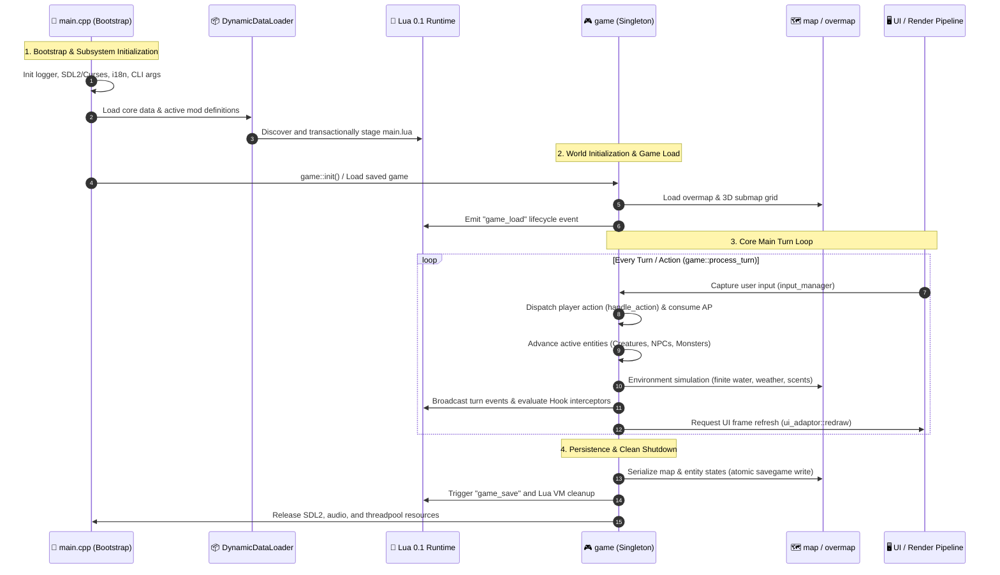

---
# GENERATED FROM docs-catalog.yml. DO NOT EDIT THIS BLOCK.
id: architecture.core-engine-lifecycle
title: Core Engine Lifecycle and Main Loop
language: en
status: active
doc_type: explanation
audiences:
- mod-author
- api-user
- experienced-contributor
- maintainer
owners:
- CCB Lua API maintainers
reviewers:
- Documentation reviewers
- Lua API reviewers
review_interval_days: 60
last_human_reviewer: LYHGLYTX
source_paths:
- data/lua/README.md
- data/lua/manifest.schema.json
- data/lua/types/ccb_api_v5.d.lua
- data/lua/reference/ccb_public_api_v5.json
- data/lua/reference/ccb_public_api_v5_coverage.json
- tools/lua_api/README.md
source_symbols:
- Lua Mod API v5
source_queries: []
source_fingerprint: 30a19e6cbd8c6709ac5ccda80fe349e9459ddaccd8d3dc96507ee282c17f48cb
authority: api-contract
verified_commit: d32b9cc880a85480840d82cfa05d256c78a16615
verified_at: '2026-08-02'
generated: false
generated_by: null
include_in_search: true
include_in_ai_index: true
translation_status: current
translation_stale_since: null
translation_source_fingerprint: e2e764d412ef85a2da5058d71cb37fbeb52a488afe41552d505db490351c3512
prerequisites:
- architecture.overview
depends_on: []
redirect_from: []
supersedes:
- lua.v5.overview
license: CC-BY-SA-3.0
attribution: CCB contributors; generated contract and source paths at the verified commit.
example_validation_ids: []
api_version: '5'
deprecated: false
deprecation_replacement: null
risk_group: lua-api
risk_level: high
pending_source_pr: null
stale_reason: null
canonical_url: https://crimsoncrossbunker.github.io/CCB-Docs/en/architecture/core-engine-lifecycle/
alternate_urls:
  zh: https://crimsoncrossbunker.github.io/CCB-Docs/architecture/core-engine-lifecycle/
  en: https://crimsoncrossbunker.github.io/CCB-Docs/en/architecture/core-engine-lifecycle/
  x-default: https://crimsoncrossbunker.github.io/CCB-Docs/architecture/core-engine-lifecycle/
source_repository: https://github.com/CrimsonCrossBunker/Cataclysm-Cleanwater-Bomb
source_commit_url: https://github.com/CrimsonCrossBunker/Cataclysm-Cleanwater-Bomb/commit/d32b9cc880a85480840d82cfa05d256c78a16615
source_urls:
- path: data/lua/README.md
  url: https://github.com/CrimsonCrossBunker/Cataclysm-Cleanwater-Bomb/blob/d32b9cc880a85480840d82cfa05d256c78a16615/data/lua/README.md
- path: data/lua/manifest.schema.json
  url: https://github.com/CrimsonCrossBunker/Cataclysm-Cleanwater-Bomb/blob/d32b9cc880a85480840d82cfa05d256c78a16615/data/lua/manifest.schema.json
- path: data/lua/types/ccb_api_v5.d.lua
  url: https://github.com/CrimsonCrossBunker/Cataclysm-Cleanwater-Bomb/blob/d32b9cc880a85480840d82cfa05d256c78a16615/data/lua/types/ccb_api_v5.d.lua
- path: data/lua/reference/ccb_public_api_v5.json
  url: https://github.com/CrimsonCrossBunker/Cataclysm-Cleanwater-Bomb/blob/d32b9cc880a85480840d82cfa05d256c78a16615/data/lua/reference/ccb_public_api_v5.json
- path: data/lua/reference/ccb_public_api_v5_coverage.json
  url: https://github.com/CrimsonCrossBunker/Cataclysm-Cleanwater-Bomb/blob/d32b9cc880a85480840d82cfa05d256c78a16615/data/lua/reference/ccb_public_api_v5_coverage.json
- path: tools/lua_api/README.md
  url: https://github.com/CrimsonCrossBunker/Cataclysm-Cleanwater-Bomb/blob/d32b9cc880a85480840d82cfa05d256c78a16615/tools/lua_api/README.md
documentation_issue_url: https://github.com/CrimsonCrossBunker/CCB-Docs/issues/new?title=docs%28architecture.core-engine-lifecycle%29%3A+&body=Document+ID%3A+architecture.core-engine-lifecycle%0ALanguage%3A+en%0AVerified+commit%3A+d32b9cc880a85480840d82cfa05d256c78a16615%0A%0ADescribe+the+documentation+problem%3A%0A
---

# Core Engine Lifecycle & Main Loop Deep-Dive

This document provides a comprehensive breakdown of the **Cataclysm: Cleanwater Bomb (CCB)** game engine control flow—from process bootstrapping, multi-phase content loading, world initialization to the per-turn main loop and atomic persistence.

---

## 1. Global Lifecycle Sequence Diagram



---

## 2. Phase 1: Bootstrap & Multi-Phase Loading Pipeline

Execution begins in `src/main.cpp`:
1. **Low-Level Runtimes**: Initialize `debug.cpp` logging, crash handlers, graphics/audio contexts (SDL2/OpenGL or Curses), and gettext translations.
2. **Content Ingestion**:
   - `DynamicDataLoader` parses core and mod definitions in topological order.
   - The Lua 0.1 VM initializes namespaces (`game.*`, `map.*`, `player.*`, `events.*`).
   - Mod `main.lua` entry points are executed in a staged transactional sandbox with atomic rollback on syntax/semantic errors.

---

## 3. Phase 2: Action-Point Turn Loop (`game::process_turn`)

CCB is a semi-discrete turn-based simulation driven by **Action Points (AP / Moves)**:

```cpp
void game::do_turn() {
    while( is_game_running() ) {
        if( avatar.get_moves() <= 0 ) {
            handle_user_input(); // Block for player action
        }
        
        avatar.process_turn(); // Tick avatar stats, pain, stamina
        
        for( monster &critter : active_monsters ) {
            critter.process_turn();
            if( critter.get_moves() > 0 ) {
                critter.move(); // Execute monster AI
            }
        }
        
        map.process_fields();        // Fire, smoke, gas diffusion
        weather.process();           // Precipitation and wind
        finite_water.simulate_step();// Fluid dynamics step
        
        catalua_events::emit_turn_end( calendar::turn );
        ui_adaptor::redraw_all();
    }
}
```

---

## 4. Phase 3: Physics & Environmental Simulation

* **Finite Water Dynamics**: Fluid mass is conserved. Water flows across gradients, pooling in depressions, and responding to drainage and pumps.
* **3D Shadowcasting**: Calculates illumination and line-of-sight across 3D octants with multi-$z$-level raycast propagation.

---

## 5. Phase 4: Atomic Persistence & Cleanup

* **Atomic File Writes**: Save files are written to `.tmp` scratch files and atomically renamed only after CRC verification.
* **Lua State Serialization**: Custom mod state tables stored via `state.character` or `state.world` are serialized into the save stream.
