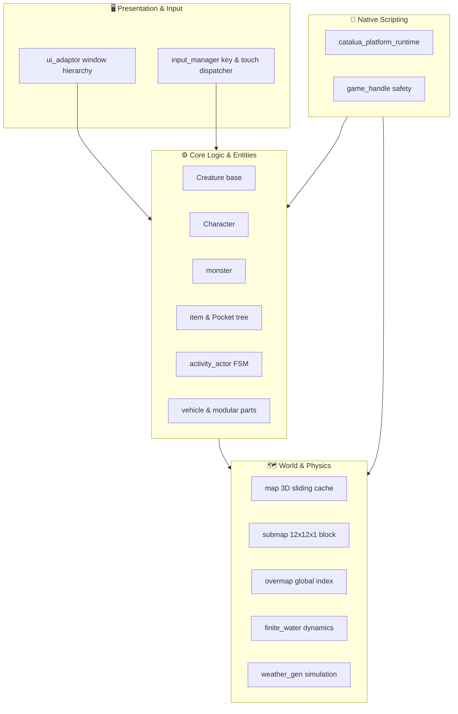

---
# GENERATED FROM docs-catalog.yml. DO NOT EDIT THIS BLOCK.
id: architecture.subsystems-deep-dive
title: Engine Subsystems Deep Dive
language: en
status: stale
doc_type: explanation
audiences:
- mod-author
- api-user
- experienced-contributor
- maintainer
owners:
- CCB Lua API maintainers
reviewers:
- Documentation reviewers
- Lua API reviewers
review_interval_days: 60
last_human_reviewer: LYHGLYTX
source_paths:
- data/lua/README.md
- data/lua/manifest.schema.json
- data/lua/types/ccb_api_v5.d.lua
- data/lua/reference/ccb_public_api_v5.json
- data/lua/reference/ccb_public_api_v5_coverage.json
- tools/lua_api/README.md
source_symbols:
- Lua Mod API v5
source_queries: []
source_fingerprint: 30a19e6cbd8c6709ac5ccda80fe349e9459ddaccd8d3dc96507ee282c17f48cb
authority: api-contract
verified_commit: d32b9cc880a85480840d82cfa05d256c78a16615
verified_at: '2026-08-02'
generated: false
generated_by: null
include_in_search: false
include_in_ai_index: false
translation_status: current
translation_stale_since: null
translation_source_fingerprint: e702f0ae0996fceeb5823bd66e23fe91ad1d6893dd54ae97234ca8f36f387b4d
prerequisites:
- architecture.overview
depends_on: []
redirect_from: []
supersedes:
- lua.v5.overview
license: CC-BY-SA-3.0
attribution: CCB contributors; generated contract and source paths at the verified commit.
example_validation_ids: []
api_version: '5'
deprecated: false
deprecation_replacement: null
risk_group: lua-api
risk_level: high
pending_source_pr: null
stale_reason: Contains retired Lua API examples; Lua sections need Platform v1 source verification.
canonical_url: https://crimsoncrossbunker.github.io/CCB-Docs/en/architecture/subsystems-deep-dive/
alternate_urls:
  zh: https://crimsoncrossbunker.github.io/CCB-Docs/architecture/subsystems-deep-dive/
  en: https://crimsoncrossbunker.github.io/CCB-Docs/en/architecture/subsystems-deep-dive/
  x-default: https://crimsoncrossbunker.github.io/CCB-Docs/architecture/subsystems-deep-dive/
source_repository: https://github.com/CrimsonCrossBunker/Cataclysm-Cleanwater-Bomb
source_commit_url: https://github.com/CrimsonCrossBunker/Cataclysm-Cleanwater-Bomb/commit/d32b9cc880a85480840d82cfa05d256c78a16615
source_urls:
- path: data/lua/README.md
  url: https://github.com/CrimsonCrossBunker/Cataclysm-Cleanwater-Bomb/blob/d32b9cc880a85480840d82cfa05d256c78a16615/data/lua/README.md
- path: data/lua/manifest.schema.json
  url: https://github.com/CrimsonCrossBunker/Cataclysm-Cleanwater-Bomb/blob/d32b9cc880a85480840d82cfa05d256c78a16615/data/lua/manifest.schema.json
- path: data/lua/types/ccb_api_v5.d.lua
  url: https://github.com/CrimsonCrossBunker/Cataclysm-Cleanwater-Bomb/blob/d32b9cc880a85480840d82cfa05d256c78a16615/data/lua/types/ccb_api_v5.d.lua
- path: data/lua/reference/ccb_public_api_v5.json
  url: https://github.com/CrimsonCrossBunker/Cataclysm-Cleanwater-Bomb/blob/d32b9cc880a85480840d82cfa05d256c78a16615/data/lua/reference/ccb_public_api_v5.json
- path: data/lua/reference/ccb_public_api_v5_coverage.json
  url: https://github.com/CrimsonCrossBunker/Cataclysm-Cleanwater-Bomb/blob/d32b9cc880a85480840d82cfa05d256c78a16615/data/lua/reference/ccb_public_api_v5_coverage.json
- path: tools/lua_api/README.md
  url: https://github.com/CrimsonCrossBunker/Cataclysm-Cleanwater-Bomb/blob/d32b9cc880a85480840d82cfa05d256c78a16615/tools/lua_api/README.md
documentation_issue_url: https://github.com/CrimsonCrossBunker/CCB-Docs/issues/new?title=docs%28architecture.subsystems-deep-dive%29%3A+&body=Document+ID%3A+architecture.subsystems-deep-dive%0ALanguage%3A+en%0AVerified+commit%3A+d32b9cc880a85480840d82cfa05d256c78a16615%0A%0ADescribe+the+documentation+problem%3A%0A
search:
  exclude: true
---

> **Lua sections need revision:** This page contains removed v5 APIs or old runtime examples. Do not use its Lua examples for current development. Start with [Platform v1](../api/lua/v1/overview.md).

# Engine Subsystems Deep Dive

This document dissects the **eight key subsystems** of the **Cataclysm: Cleanwater Bomb (CCB)** C++ engine, illustrating their class inheritance hierarchies, responsibility boundaries, and runtime data flows.

---

## 1. Architectural Overview

---

## 2. Subsystem 1: Creatures and Characters

* **`Creature`**: Base living entity providing 3D coordinates (`tripoint`), speed counters (`moves`), turn advancement, and damage calculation (`deal_damage`).
* **`Character`**: Humanoid actor managing bodily anatomy (`bodypart_map`), pain, encumbrance, and inventory trees.
* **`avatar` & `npc`**: Concrete character types bound to user input dispatch and NPC AI decision trees respectively.
* **`monster`**: Hostile, neutral, or friendly non-humanoid creatures with species traits, target acquisition, and special attacks.

---

## 3. Subsystem 2: World, Maps & Submaps

1. **3D Tripoints**: Integral coordinate vector $(x, y, z)$ modeling multi-level reality.
2. **Local Map Cache (`map` & `submap`)**: The world is partitioned into **$12 \times 12 \times 1$ `submap`** chunks. The active loaded viewport maintains a sliding grid of $11 \times 11$ submaps around the player.
3. **Overmap (`overmap`)**: Global macro-grid managing world generation, city layouts, roads, and persistent region landmarks.

---

## 4. Subsystem 3: Recursive Pocket Inventory Model

* **`item`**: Core physical entity with weight, volume, damage stats, and custom metadata.
* **`item_pocket`**: Structured container compartments with volume, weight, dimension, and fluid-tight limits.
* **Recursive Real-Time Evaluation**: Nested containers (e.g. ammo in a pouch inside a backpack on a vest) compute total mass, volume, and draw costs dynamically.

---

## 5. Subsystem 4: Activity Actor State Machines

Multi-turn actions (crafting, vehicle repair, reading, constructing) run inside `activity_actor` state machines:
* Track fractional action points and required tools.
* **Automatic Threat Interruption**: Halts activities upon hearing gunfire or detecting enemy approaches to ensure player safety.

---

## 6. Subsystem 5: Physics & Finite Water Dynamics

* **Finite Water Dynamics (`finite_water.cpp`)**: Fluid volume is strictly conserved across elevations, supporting realistic pooling, fluid pressure, drainage, and pumping.
* **Field Simulation (`field_entry`)**: Dynamic diffusion and concentration dissipation for fire, smoke, and toxic chemical clouds.

---

## 7. Subsystem 6: Vehicles and Modular Parts

* **`vehicle`**: Rigid-body physics entity simulating engine power, mass distribution, steering traction, and structural integrity.
* **`vpart_reference`**: Granular parts (tires, armor plates, fuel tanks, solar arrays) with independent damage modeling.

---

## 8. Subsystem 7: Cross-Platform UI & Input Dispatch

* **`ui_adaptor`**: Manages window hierarchies, modal dialogs, and dirty-region redrawing.
* **`input_manager`**: Translates PC keyboard keycodes, gamepads, and Android multi-touch gestures into unified game actions.

---

## 9. Subsystem 8: CCB Lua 0.1 Platform Bridge

* **Sol2 Direct In-Memory Interop**: Direct C++ to Lua function calls with zero intermediate JSON parsing.
* **`game_handle` Safety**: Protects against dangling pointers by validating entity generations upon every Lua dereference.
* **Staged Transactional Commits**: Sandboxes mod content registration with atomic rollback on failure.
