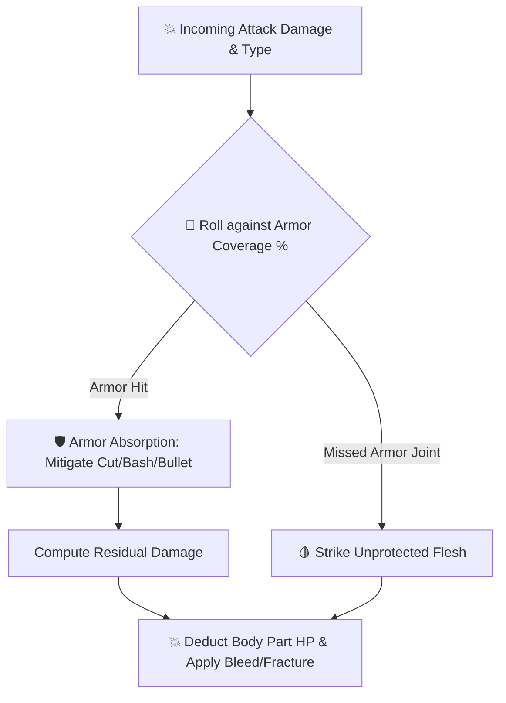

---
# GENERATED FROM docs-catalog.yml. DO NOT EDIT THIS BLOCK.
id: subsystems.combat
title: Combat and Damage Manual
language: en
status: stale
doc_type: explanation
audiences:
- mod-author
- api-user
- experienced-contributor
- maintainer
owners:
- CCB Lua API maintainers
reviewers:
- Documentation reviewers
- Lua API reviewers
review_interval_days: 60
last_human_reviewer: LYHGLYTX
source_paths:
- data/lua/README.md
- data/lua/manifest.schema.json
- data/lua/types/ccb_api_v5.d.lua
- data/lua/reference/ccb_public_api_v5.json
- data/lua/reference/ccb_public_api_v5_coverage.json
- tools/lua_api/README.md
source_symbols:
- Lua Mod API v5
source_queries: []
source_fingerprint: 30a19e6cbd8c6709ac5ccda80fe349e9459ddaccd8d3dc96507ee282c17f48cb
authority: api-contract
verified_commit: d32b9cc880a85480840d82cfa05d256c78a16615
verified_at: '2026-08-02'
generated: false
generated_by: null
include_in_search: false
include_in_ai_index: false
translation_status: current
translation_stale_since: null
translation_source_fingerprint: dd9f52d118e7d3a1921e8dfe04d2479b996d5b8852005f2c501da06d10126dc1
prerequisites:
- architecture.overview
depends_on: []
redirect_from: []
supersedes:
- lua.v5.overview
license: CC-BY-SA-3.0
attribution: CCB contributors; generated contract and source paths at the verified commit.
example_validation_ids: []
api_version: '5'
deprecated: false
deprecation_replacement: null
risk_group: lua-api
risk_level: high
pending_source_pr: null
stale_reason: Contains retired Lua API examples; Lua sections need Platform v1 source verification.
canonical_url: https://crimsoncrossbunker.github.io/CCB-Docs/en/subsystems/combat/
alternate_urls:
  zh: https://crimsoncrossbunker.github.io/CCB-Docs/subsystems/combat/
  en: https://crimsoncrossbunker.github.io/CCB-Docs/en/subsystems/combat/
  x-default: https://crimsoncrossbunker.github.io/CCB-Docs/subsystems/combat/
source_repository: https://github.com/CrimsonCrossBunker/Cataclysm-Cleanwater-Bomb
source_commit_url: https://github.com/CrimsonCrossBunker/Cataclysm-Cleanwater-Bomb/commit/d32b9cc880a85480840d82cfa05d256c78a16615
source_urls:
- path: data/lua/README.md
  url: https://github.com/CrimsonCrossBunker/Cataclysm-Cleanwater-Bomb/blob/d32b9cc880a85480840d82cfa05d256c78a16615/data/lua/README.md
- path: data/lua/manifest.schema.json
  url: https://github.com/CrimsonCrossBunker/Cataclysm-Cleanwater-Bomb/blob/d32b9cc880a85480840d82cfa05d256c78a16615/data/lua/manifest.schema.json
- path: data/lua/types/ccb_api_v5.d.lua
  url: https://github.com/CrimsonCrossBunker/Cataclysm-Cleanwater-Bomb/blob/d32b9cc880a85480840d82cfa05d256c78a16615/data/lua/types/ccb_api_v5.d.lua
- path: data/lua/reference/ccb_public_api_v5.json
  url: https://github.com/CrimsonCrossBunker/Cataclysm-Cleanwater-Bomb/blob/d32b9cc880a85480840d82cfa05d256c78a16615/data/lua/reference/ccb_public_api_v5.json
- path: data/lua/reference/ccb_public_api_v5_coverage.json
  url: https://github.com/CrimsonCrossBunker/Cataclysm-Cleanwater-Bomb/blob/d32b9cc880a85480840d82cfa05d256c78a16615/data/lua/reference/ccb_public_api_v5_coverage.json
- path: tools/lua_api/README.md
  url: https://github.com/CrimsonCrossBunker/Cataclysm-Cleanwater-Bomb/blob/d32b9cc880a85480840d82cfa05d256c78a16615/tools/lua_api/README.md
documentation_issue_url: https://github.com/CrimsonCrossBunker/CCB-Docs/issues/new?title=docs%28subsystems.combat%29%3A+&body=Document+ID%3A+subsystems.combat%0ALanguage%3A+en%0AVerified+commit%3A+d32b9cc880a85480840d82cfa05d256c78a16615%0A%0ADescribe+the+documentation+problem%3A%0A
search:
  exclude: true
---

> **Lua sections need revision:** This page contains removed v5 APIs or old runtime examples. Do not use its Lua examples for current development. Start with [Platform v1](../api/lua/v1/overview.md).

# Combat & Damage Manual

This manual details the combat mechanics, multi-type damage calculations, armor coverage checks, and mitigation algorithms in **Cataclysm: Cleanwater Bomb (CCB)**.

---

## 1. Damage Types System

| Damage Type ID | Name | Physical Behavior & Characteristics |
| :--- | :--- | :--- |
| `"bash"` | Blunt Impact | Shockwave damage. Bypasses flexible fabrics to cause fractures and internal bleeding. |
| `"cut"` | Edge Slicing | Blocked by hard plates. Severe bleeding upon flesh penetration. |
| `"pierce"` | Puncture | Concentrated force that bypasses armor joints. |
| `"bullet"` | Ballistic | Kinetic impact from high-velocity projectiles. Mitigated by ballistic inserts. |
| `"acid"` | Corrosive | Chemical breakdown that degrades gear durability. |
| `"electric"` | Conductive | Causes muscle spasms, weapon drops, and stuns. Amplified by metals. |
| `"heat"` | Thermal | Ignites flammable gear and causes burn injuries. |

---

## 2. Armor Resolution Pipeline



1. **Coverage Roll**: Random roll $(1 \sim 100)$ against armor `coverage` percentage.
2. **Layer Stacking**: Damage passes sequentially from outer tactical carriers to inner undergarments.
3. **Armor Wear**: High-impact strikes wear down structural durability.

---

## 3. Intercepting Damage with Lua Hooks

```lua
game.hooks.on("on_damage_calculate", function(context)
    local defender = context.defender
    local damage_instance = context.damage
    
    if defender:has_effect("energy_barrier") then
        damage_instance:mult_damage("bullet", 0.5)
        damage_instance:mult_damage("cut", 0.5)
        game.add_msg("info", "The energy shield flashes, deflecting incoming kinetic energy!")
    end
    
    return true
end)
```
