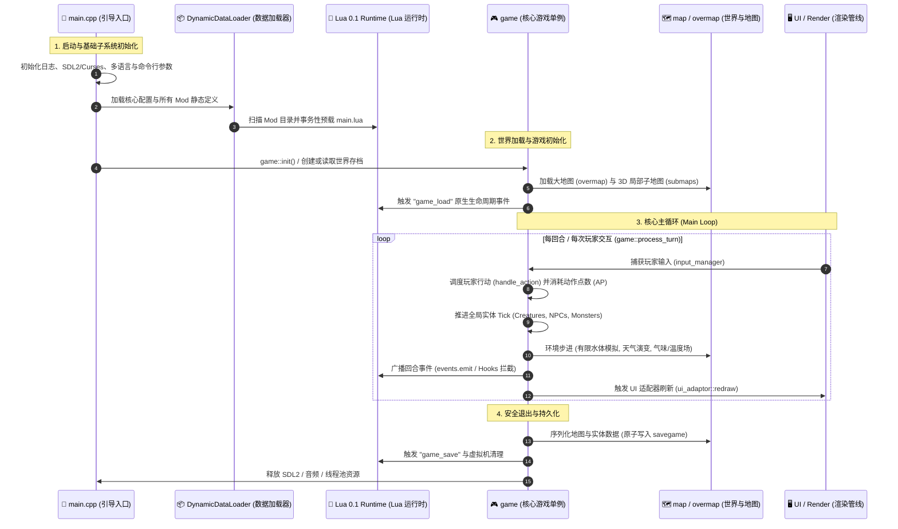

---
# GENERATED FROM docs-catalog.yml. DO NOT EDIT THIS BLOCK.
id: architecture.core-engine-lifecycle
title: 游戏引擎生命周期与主循环深度剖析
language: zh_CN
status: stale
doc_type: explanation
audiences:
- mod-author
- api-user
- experienced-contributor
- maintainer
owners:
- CCB Lua API maintainers
reviewers:
- Documentation reviewers
- Lua API reviewers
review_interval_days: 60
last_human_reviewer: LYHGLYTX
source_paths:
- data/lua/README.md
- data/lua/manifest.schema.json
- data/lua/types/ccb_api_v5.d.lua
- data/lua/reference/ccb_public_api_v5.json
- data/lua/reference/ccb_public_api_v5_coverage.json
- tools/lua_api/README.md
source_symbols:
- Lua Mod API v5
source_queries: []
source_fingerprint: 30a19e6cbd8c6709ac5ccda80fe349e9459ddaccd8d3dc96507ee282c17f48cb
authority: api-contract
verified_commit: d32b9cc880a85480840d82cfa05d256c78a16615
verified_at: '2026-08-02'
generated: false
generated_by: null
include_in_search: false
include_in_ai_index: false
translation_status: current
translation_stale_since: null
translation_source_fingerprint: 7a3f0327a2d25c9a9fe4883996b14a96f48a74a3d5f98d67054b29a4c10c63c9
prerequisites:
- architecture.overview
depends_on: []
redirect_from: []
supersedes:
- lua.v5.overview
license: CC-BY-SA-3.0
attribution: CCB contributors; generated contract and source paths at the verified commit.
example_validation_ids: []
api_version: '5'
deprecated: false
deprecation_replacement: null
risk_group: lua-api
risk_level: high
pending_source_pr: null
stale_reason: Contains retired Lua API examples; Lua sections need Platform v1 source verification.
canonical_url: https://crimsoncrossbunker.github.io/CCB-Docs/architecture/core-engine-lifecycle/
alternate_urls:
  zh: https://crimsoncrossbunker.github.io/CCB-Docs/architecture/core-engine-lifecycle/
  en: https://crimsoncrossbunker.github.io/CCB-Docs/en/architecture/core-engine-lifecycle/
  x-default: https://crimsoncrossbunker.github.io/CCB-Docs/architecture/core-engine-lifecycle/
source_repository: https://github.com/CrimsonCrossBunker/Cataclysm-Cleanwater-Bomb
source_commit_url: https://github.com/CrimsonCrossBunker/Cataclysm-Cleanwater-Bomb/commit/d32b9cc880a85480840d82cfa05d256c78a16615
source_urls:
- path: data/lua/README.md
  url: https://github.com/CrimsonCrossBunker/Cataclysm-Cleanwater-Bomb/blob/d32b9cc880a85480840d82cfa05d256c78a16615/data/lua/README.md
- path: data/lua/manifest.schema.json
  url: https://github.com/CrimsonCrossBunker/Cataclysm-Cleanwater-Bomb/blob/d32b9cc880a85480840d82cfa05d256c78a16615/data/lua/manifest.schema.json
- path: data/lua/types/ccb_api_v5.d.lua
  url: https://github.com/CrimsonCrossBunker/Cataclysm-Cleanwater-Bomb/blob/d32b9cc880a85480840d82cfa05d256c78a16615/data/lua/types/ccb_api_v5.d.lua
- path: data/lua/reference/ccb_public_api_v5.json
  url: https://github.com/CrimsonCrossBunker/Cataclysm-Cleanwater-Bomb/blob/d32b9cc880a85480840d82cfa05d256c78a16615/data/lua/reference/ccb_public_api_v5.json
- path: data/lua/reference/ccb_public_api_v5_coverage.json
  url: https://github.com/CrimsonCrossBunker/Cataclysm-Cleanwater-Bomb/blob/d32b9cc880a85480840d82cfa05d256c78a16615/data/lua/reference/ccb_public_api_v5_coverage.json
- path: tools/lua_api/README.md
  url: https://github.com/CrimsonCrossBunker/Cataclysm-Cleanwater-Bomb/blob/d32b9cc880a85480840d82cfa05d256c78a16615/tools/lua_api/README.md
documentation_issue_url: https://github.com/CrimsonCrossBunker/CCB-Docs/issues/new?title=docs%28architecture.core-engine-lifecycle%29%3A+&body=Document+ID%3A+architecture.core-engine-lifecycle%0ALanguage%3A+zh_CN%0AVerified+commit%3A+d32b9cc880a85480840d82cfa05d256c78a16615%0A%0ADescribe+the+documentation+problem%3A%0A
search:
  exclude: true
---

> **Lua 内容待修订：** 本页仍含已移除的 v5 接口或旧运行时示例，不可作为当前 Lua 开发依据。请使用 [Platform v1 入门](../api/lua/v1/overview.md)。

# 游戏引擎生命周期与主循环深度剖析 (Engine Lifecycle & Main Loop)

本文档深入剖析 **Cataclysm: Cleanwater Bomb (CCB)** 游戏引擎从程序启动、数据加载、世界初始化到每回合主循环（Main Turn Loop）与退出保存的完整底层生命周期与控制流。

---

## 1. 引擎全局生命周期全景图



---

## 2. 阶段一：引导启动与多阶段数据装载 (Bootstrap & Loading Pipeline)

程序的入口位于 `src/main.cpp`，按严格的先后顺序初始化底层子系统：

### 1. 基础运行时初始化
* **日志与崩溃追踪**：初始化 `debug.cpp` 与 Crash Handler 信号监听。
* **图形与音频后端**：SDL2 窗口创建、OpenGL/Direct3D 渲染上下文绑定或 Curses 字符终端初始化。
* **本地化支持**：加载 `gettext` 翻译与本地字体渲染表。

### 2. 多阶段内容加载 (`DynamicDataLoader`)
* **Core 数据层**：加载基础地形、家具、物品原型、技能与天气配置。
* **Mod 依赖拓扑排序**：解析所有已启用 Mod 的依赖关系图，确保前置依赖优先加载。
* **Lua 0.1 运行时装载**：
  * 初始化 `sol::state` 主虚拟机。
  * 注册核心命名空间（`game.*`, `map.*`, `player.*`, `ui.*`, `events.*`）。
  * 扫描各 Mod 根目录下的 `main.lua`，以 **Staged 事务隔离模式** 执行预载；若发生语法或逻辑异常，自动执行原子回滚并输出错误诊断。

---

## 3. 阶段二：核心回合主循环 (`game::process_turn`)

CCB 是一个**基于动作点数（Action Points, AP）的半离散回合制游戏**。游戏的主循环在 `game::process_turn()` 中驱动：

```cpp
// 核心主循环逻辑伪代码解析 (src/game.cpp)
void game::do_turn() {
    while( is_game_running() ) {
        // 1. 处理玩家输入与交互
        if( avatar.get_moves() <= 0 ) {
            handle_user_input(); // 阻塞等待玩家按键或触屏操作
        }
        
        // 2. 推进玩家动作点数与活动状态
        avatar.process_turn();
        
        // 3. 推进世界中所有活跃实体 (Monsters, NPCs)
        for( monster &critter : active_monsters ) {
            critter.process_turn();
            if( critter.get_moves() > 0 ) {
                critter.move(); // 执行 AI 寻路与攻击
            }
        }
        
        // 4. 环境物理场演进
        map.process_fields();        // 毒雾、火焰、烟雾扩散
        weather.process();           // 风速、降水、雷暴计算
        finite_water.simulate_step();// 有限水体流体动力学演进
        
        // 5. 广播 Lua 原生事件
        catalua_events::emit_turn_end( calendar::turn );
        
        // 6. 渲染管线刷新
        ui_adaptor::redraw_all();
    }
}
```

---

## 4. 阶段三：环境物理模拟与有限水体

在每回合的物理推进阶段，CCB 具备区别于传统分支的高精度物理模拟：
* **有限水体（Finite Water System）**：水体不再是无限刷新的静态标记，而是具备体积守恒的流体网格。地势高低差和重力会驱动水流向低洼处扩散，并在抽水、蒸发或堵塞时动态增减。
* **视线算法（Shadowcasting）**：通过三维八分体射线追踪算法实时计算光照衰减与视野阻挡，精确处理跨 $z$ 轴高低差视线。

---

## 5. 阶段四：安全存档与资源析构

当玩家选择保存或退出时：
1. **原子写入（Atomic File Write）**：存档首先写入临时文件 `.tmp`，在完全校验 CRC 校验码无误后重命名覆盖，防止断电导致存档损坏。
2. **Lua 状态序列化**：Mod 通过 `state.character` 或 `state.world` 存储的自定义表数据会被一并打包压缩存入存档流。
3. **安全关机**：释放所有 Sol2 句柄池、清理 Submap 内存缓存并安全退出主进程。
