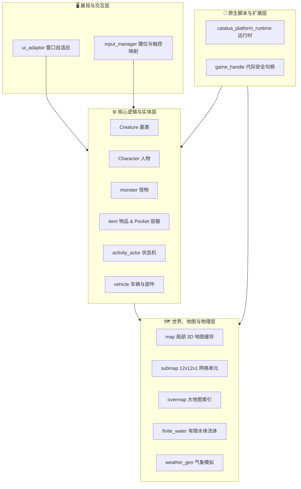
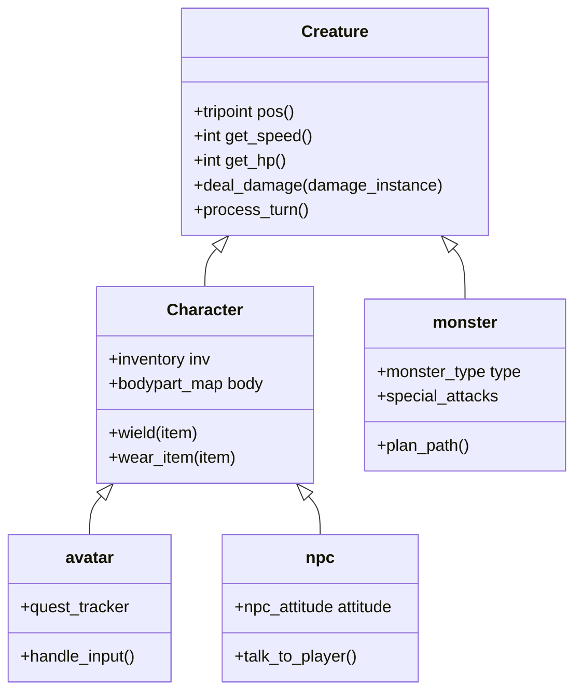

---
# GENERATED FROM docs-catalog.yml. DO NOT EDIT THIS BLOCK.
id: architecture.subsystems-deep-dive
title: 游戏引擎核心八大子系统深度剖析
language: zh_CN
status: stale
doc_type: explanation
audiences:
- mod-author
- api-user
- experienced-contributor
- maintainer
owners:
- CCB Lua API maintainers
reviewers:
- Documentation reviewers
- Lua API reviewers
review_interval_days: 60
last_human_reviewer: LYHGLYTX
source_paths:
- data/lua/README.md
- data/lua/manifest.schema.json
- data/lua/types/ccb_api_v5.d.lua
- data/lua/reference/ccb_public_api_v5.json
- data/lua/reference/ccb_public_api_v5_coverage.json
- tools/lua_api/README.md
source_symbols:
- Lua Mod API v5
source_queries: []
source_fingerprint: 30a19e6cbd8c6709ac5ccda80fe349e9459ddaccd8d3dc96507ee282c17f48cb
authority: api-contract
verified_commit: d32b9cc880a85480840d82cfa05d256c78a16615
verified_at: '2026-08-02'
generated: false
generated_by: null
include_in_search: false
include_in_ai_index: false
translation_status: current
translation_stale_since: null
translation_source_fingerprint: e702f0ae0996fceeb5823bd66e23fe91ad1d6893dd54ae97234ca8f36f387b4d
prerequisites:
- architecture.overview
depends_on: []
redirect_from: []
supersedes:
- lua.v5.overview
license: CC-BY-SA-3.0
attribution: CCB contributors; generated contract and source paths at the verified commit.
example_validation_ids: []
api_version: '5'
deprecated: false
deprecation_replacement: null
risk_group: lua-api
risk_level: high
pending_source_pr: null
stale_reason: Contains retired Lua API examples; Lua sections need Platform v1 source verification.
canonical_url: https://crimsoncrossbunker.github.io/CCB-Docs/architecture/subsystems-deep-dive/
alternate_urls:
  zh: https://crimsoncrossbunker.github.io/CCB-Docs/architecture/subsystems-deep-dive/
  en: https://crimsoncrossbunker.github.io/CCB-Docs/en/architecture/subsystems-deep-dive/
  x-default: https://crimsoncrossbunker.github.io/CCB-Docs/architecture/subsystems-deep-dive/
source_repository: https://github.com/CrimsonCrossBunker/Cataclysm-Cleanwater-Bomb
source_commit_url: https://github.com/CrimsonCrossBunker/Cataclysm-Cleanwater-Bomb/commit/d32b9cc880a85480840d82cfa05d256c78a16615
source_urls:
- path: data/lua/README.md
  url: https://github.com/CrimsonCrossBunker/Cataclysm-Cleanwater-Bomb/blob/d32b9cc880a85480840d82cfa05d256c78a16615/data/lua/README.md
- path: data/lua/manifest.schema.json
  url: https://github.com/CrimsonCrossBunker/Cataclysm-Cleanwater-Bomb/blob/d32b9cc880a85480840d82cfa05d256c78a16615/data/lua/manifest.schema.json
- path: data/lua/types/ccb_api_v5.d.lua
  url: https://github.com/CrimsonCrossBunker/Cataclysm-Cleanwater-Bomb/blob/d32b9cc880a85480840d82cfa05d256c78a16615/data/lua/types/ccb_api_v5.d.lua
- path: data/lua/reference/ccb_public_api_v5.json
  url: https://github.com/CrimsonCrossBunker/Cataclysm-Cleanwater-Bomb/blob/d32b9cc880a85480840d82cfa05d256c78a16615/data/lua/reference/ccb_public_api_v5.json
- path: data/lua/reference/ccb_public_api_v5_coverage.json
  url: https://github.com/CrimsonCrossBunker/Cataclysm-Cleanwater-Bomb/blob/d32b9cc880a85480840d82cfa05d256c78a16615/data/lua/reference/ccb_public_api_v5_coverage.json
- path: tools/lua_api/README.md
  url: https://github.com/CrimsonCrossBunker/Cataclysm-Cleanwater-Bomb/blob/d32b9cc880a85480840d82cfa05d256c78a16615/tools/lua_api/README.md
documentation_issue_url: https://github.com/CrimsonCrossBunker/CCB-Docs/issues/new?title=docs%28architecture.subsystems-deep-dive%29%3A+&body=Document+ID%3A+architecture.subsystems-deep-dive%0ALanguage%3A+zh_CN%0AVerified+commit%3A+d32b9cc880a85480840d82cfa05d256c78a16615%0A%0ADescribe+the+documentation+problem%3A%0A
search:
  exclude: true
---

> **Lua 内容待修订：** 本页仍含已移除的 v5 接口或旧运行时示例，不可作为当前 Lua 开发依据。请使用 [Platform v1 入门](../api/lua/v1/overview.md)。

# 游戏引擎核心八大子系统深度剖析 (Engine Subsystems Deep Dive)

本文档面向 C++ 引擎开发者与高级 Mod 创作者，全景拆解 **Cataclysm: Cleanwater Bomb (CCB)** 核心引擎的 **八大关键子系统**、其类继承关系与底层数据流。

---

## 1. 核心架构全景分层图

---

## 2. 子系统一：实体与生命系统 (Creatures & Characters)

CCB 的生物实体采用经典的面向对象多态继承结构：

* **`Creature`（基础生物类）**：封装三维坐标（`tripoint`）、基础移动速度（`moves`）、每回合生命恢复与伤害计算（`deal_damage`）。
* **`Character`（人形角色基类）**：管理复杂的身体部位（`bodypart_map`）、耐受力、痛觉、属性与背包库存（`inventory`）。
* **`avatar`（玩家角色）** 与 **`npc`（非玩家角色）**：分别接入输入系统与 NPC 对话/决策 AI 状态机。
* **`monster`（怪物）**：挂载攻击 AI、仇恨与特殊攻击行为树。

---

## 3. 子系统二：三维世界与地图缓存 (World, Maps & Submaps)

CCB 的世界管理分为大地图与局部地图两级架构：

1. **三维立体坐标 `tripoint`**：由 $(x, y, z)$ 构成的整数坐标，$z$ 轴代表地下深层到高空楼层。
2. **局部地图缓存 `map` & `submap`**：
   - 游戏加载以 **`submap`（12 × 12 × 1 格）** 为最小数据单元。
   - 玩家周围始终保有一个 $11 \times 11$ 个 `submap` 的滑动窗口缓存（`map`），实现跨地块无缝移动。
3. **大地图 `overmap`**：以 $180 \times 180$ 个 Overmap Terrain（OMT，每个 OMT 对应 $2 \times 2$ 个 submap）为单位进行大尺度地理索引。

---

## 4. 子系统三：物品与 Pocket 递归容积系统 (Items & Pockets)

CCB 摒弃了传统的扁平背包，采用**基于物理容积和几何约束的 Pocket 递归树**：

* **`item`**：基础物品实体，包含材质、重量、体积、耐久度与变量表（`item_vars`）。
* **`item_pocket`**：容器口袋。一个物品可以包含 $N$ 个口袋，每个口袋具备独立的最大容积、最大重量、刚性（`rigid`）、防漏（`watertight`）与快速拔取动作消耗（`moves`）。
* **动态递归计算**：当一件外衣内装满水壶，水壶内装满药水时，外层外衣的重量与体积会根据内层口袋**递归实时求和**。

---

## 5. 子系统四：动作与持续活动状态机 (Activity Actors)

对于耗时超过 1 回合的动作（如制造装备、修理车辆、读书、建造墙体），引擎通过 `activity_actor` 状态机进行管理：
* 状态机记录当前进度点（`moves_left`）、消耗材料与工具引用。
* **即时中断判定**：每回合执行前检测周围威胁（如听到枪声、怪物接近或受到伤害），自动暂停活动并提示玩家，保障生存安全。

---

## 6. 子系统五：物理场与有限水体系统 (Physics & Finite Water)

* **有限水体（`finite_water.cpp`）**：
  - 区别于传统无穷水源，CCB 的地表水与管道水具有真实的质量守恒。
  - 水体会根据高度差流向洼地，支持水泵抽取、蒸发与水流推力计算。
* **物理场（`field_entry`）**：
  - 模拟火焰燃烧、浓烟扩散、有毒废气与酸液腐蚀的动态浓度衰减。

---

## 7. 子系统六：车辆物理与模块化部件 (Vehicles)

* **`vehicle`**：刚体车辆实体，管理发动机动力、质量分布、悬挂系统与空气动力学阻力。
* **`vpart_reference`**：车辆部件引用（车轮、装甲板、电池组、车载储水罐），部件损毁会直接影响整车的操控性与动力输出。

---

## 8. 子系统七：跨平台 UI 与输入适配器 (UI & Input Dispatch)

* **`ui_adaptor`**：统一的窗口分层管理器，实现 UI 窗口的生命周期挂钩与脏矩形重绘。
* **`input_manager`**：跨平台输入调度，自动将 PC 物理键盘扫描码、手柄轴输入以及 Android 触屏手势/虚拟摇杆转换为标准游戏动作（`action_id`）。

---

## 9. 子系统八：CCB Lua 0.1 原生桥接层 (Lua Platform Bridge)

* **Sol2 内存直连**：C++ 对象与 Lua 虚拟机通过直接内存调用通信，零中间格式。
* **`game_handle` 安全句柄**：持有 C++ 对象的弱引用句柄与代际计数器。当 C++ 实体在游戏内销毁（如怪物死亡或物品分解）时，Lua 端持有该句柄再次调用会安全返回 `nil` 或抛出捕获异常，彻底杜绝悬垂指针导致的游戏崩溃（Crash）。
* **Staged 事务隔离**：Mod 注册内容时在内存隔离区预载，若发生冲突或错误则秒级原子回滚，保护核心世界不受污染。
