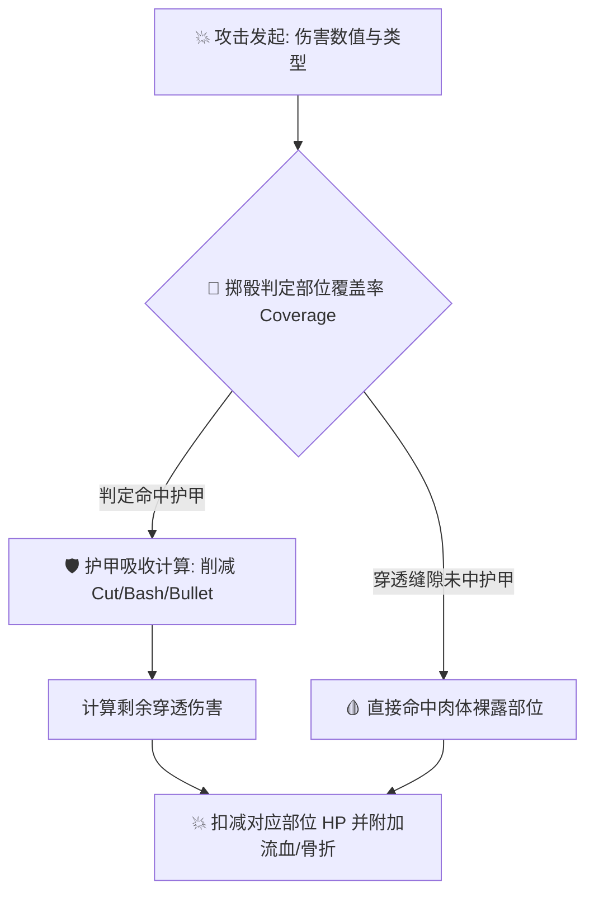

---
# GENERATED FROM docs-catalog.yml. DO NOT EDIT THIS BLOCK.
id: subsystems.combat
title: 战斗、伤害与护甲结算技术手册
language: zh_CN
status: active
doc_type: explanation
audiences:
- mod-author
- api-user
- experienced-contributor
- maintainer
owners:
- CCB Lua API maintainers
reviewers:
- Documentation reviewers
- Lua API reviewers
review_interval_days: 60
last_human_reviewer: LYHGLYTX
source_paths:
- data/lua/README.md
- data/lua/manifest.schema.json
- data/lua/types/ccb_api_v5.d.lua
- data/lua/reference/ccb_public_api_v5.json
- data/lua/reference/ccb_public_api_v5_coverage.json
- tools/lua_api/README.md
source_symbols:
- Lua Mod API v5
source_queries: []
source_fingerprint: 30a19e6cbd8c6709ac5ccda80fe349e9459ddaccd8d3dc96507ee282c17f48cb
authority: api-contract
verified_commit: d32b9cc880a85480840d82cfa05d256c78a16615
verified_at: '2026-08-02'
generated: false
generated_by: null
include_in_search: true
include_in_ai_index: true
translation_status: current
translation_stale_since: null
translation_source_fingerprint: 3d5c2e9e0c44fa2d87153b30ef6dfcbbc4e57bfa977a775db3fbae73278335b1
prerequisites:
- architecture.overview
depends_on: []
redirect_from: []
supersedes:
- lua.v5.overview
license: CC-BY-SA-3.0
attribution: CCB contributors; generated contract and source paths at the verified commit.
example_validation_ids: []
api_version: '5'
deprecated: false
deprecation_replacement: null
risk_group: lua-api
risk_level: high
pending_source_pr: null
stale_reason: null
canonical_url: https://crimsoncrossbunker.github.io/CCB-Docs/subsystems/combat/
alternate_urls:
  zh: https://crimsoncrossbunker.github.io/CCB-Docs/subsystems/combat/
  en: https://crimsoncrossbunker.github.io/CCB-Docs/en/subsystems/combat/
  x-default: https://crimsoncrossbunker.github.io/CCB-Docs/subsystems/combat/
source_repository: https://github.com/CrimsonCrossBunker/Cataclysm-Cleanwater-Bomb
source_commit_url: https://github.com/CrimsonCrossBunker/Cataclysm-Cleanwater-Bomb/commit/d32b9cc880a85480840d82cfa05d256c78a16615
source_urls:
- path: data/lua/README.md
  url: https://github.com/CrimsonCrossBunker/Cataclysm-Cleanwater-Bomb/blob/d32b9cc880a85480840d82cfa05d256c78a16615/data/lua/README.md
- path: data/lua/manifest.schema.json
  url: https://github.com/CrimsonCrossBunker/Cataclysm-Cleanwater-Bomb/blob/d32b9cc880a85480840d82cfa05d256c78a16615/data/lua/manifest.schema.json
- path: data/lua/types/ccb_api_v5.d.lua
  url: https://github.com/CrimsonCrossBunker/Cataclysm-Cleanwater-Bomb/blob/d32b9cc880a85480840d82cfa05d256c78a16615/data/lua/types/ccb_api_v5.d.lua
- path: data/lua/reference/ccb_public_api_v5.json
  url: https://github.com/CrimsonCrossBunker/Cataclysm-Cleanwater-Bomb/blob/d32b9cc880a85480840d82cfa05d256c78a16615/data/lua/reference/ccb_public_api_v5.json
- path: data/lua/reference/ccb_public_api_v5_coverage.json
  url: https://github.com/CrimsonCrossBunker/Cataclysm-Cleanwater-Bomb/blob/d32b9cc880a85480840d82cfa05d256c78a16615/data/lua/reference/ccb_public_api_v5_coverage.json
- path: tools/lua_api/README.md
  url: https://github.com/CrimsonCrossBunker/Cataclysm-Cleanwater-Bomb/blob/d32b9cc880a85480840d82cfa05d256c78a16615/tools/lua_api/README.md
documentation_issue_url: https://github.com/CrimsonCrossBunker/CCB-Docs/issues/new?title=docs%28subsystems.combat%29%3A+&body=Document+ID%3A+subsystems.combat%0ALanguage%3A+zh_CN%0AVerified+commit%3A+d32b9cc880a85480840d82cfa05d256c78a16615%0A%0ADescribe+the+documentation+problem%3A%0A
---

# 战斗、伤害与护甲结算技术手册 (Combat & Damage Manual)

本手册详细剖析 **Cataclysm: Cleanwater Bomb (CCB)** 的战斗物理系统、多类型伤害计算模型、防具覆盖率与伤害吸收结算算法。

---

## 1. 伤害类型体系 (Damage Types)

CCB 具备严密的物理伤害类型划分，每种伤害类型在穿透护甲和对肉体造成创伤时遵循不同的物理公式：

| 伤害类型 | 标识符 (`damage_type`) | 物理机制与特性 |
| :--- | :--- | :--- |
| **钝击** | `"bash"` | 冲击波震荡伤害。不易被外层柔性织物阻挡，高钝击伤害可直接引发骨折与内脏震荡。 |
| **斩击** | `"cut"` | 刃口切割伤害。高度受限于坚硬护甲（如钢板与几丁质甲壳）；一旦穿透极易引发严重流血。 |
| **穿刺** | `"pierce"` | 尖端受力集中穿透。具备优异的装甲缝隙穿透能力，造成深度穿透伤。 |
| **弹道** | `"bullet"` | 高速枪弹弹道动能。穿透力与弹头动能（焦耳）直接挂钩，依赖专用防弹插板吸收。 |
| **强酸** | `"acid"` | 化学腐蚀伤害。能持续腐蚀装备耐久度并降低护甲防护值。 |
| **电击** | `"electric"` | 传导电击伤害。导电金属装备会加剧伤害，可导致肌肉痉挛与行动瘫痪。 |
| **热能/火焰** | `"heat"` | 高温燃烧伤害。引燃易燃材质装备并造成大面积烧伤。 |

---

## 2. 护甲吸收与覆盖率计算流程 (Armor Resolution Pipeline)

当一次攻击击中角色身体部位时，引擎按照以下流程依次结算：



1. **覆盖率掷骰 (Coverage Check)**：
   * 装备具有 $0 \sim 100\%$ 的部位覆盖率（`coverage`）。
   * 引擎随机生成 $1 \sim 100$ 的数值，若数值 $\le$ 覆盖率，则攻击命中该层护甲；否则判定为从防具缝隙或未包裹部位穿透。
2. **多层防具累加结算**：
   * 角色同时穿戴贴身衣物、主防护服与外层防弹背心时，攻击将从最外层向内逐层进行吸收结算。
3. **耐久度磨损 (Armor Degradation)**：
   * 强力攻击在被坚硬护甲阻挡时，会消耗护甲本身的结构耐久度。

---

## 3. 近战与远程攻击参数

在定义武器时，核心战斗参数如下：

```lua
-- 近战武器属性表定义
melee = {
    damage = {
        cut = 24,      -- 基础斩击伤害
        pierce = 10,   -- 基础穿刺伤害
        bash = 4,      -- 基础钝击伤害
    },
    attack_cost = 80,  -- 每次攻击消耗 80 AP (标准移动速度下约为 0.8 回合)
    to_hit = 2,        -- 命中骰修正加成
}
```

---

## 4. 实战：使用 Hook 拦截与重写伤害结算

Mod 可以利用 CCB 原生 Hook 同步拦截伤害结算，实现魔法护盾、能量偏折力场或反击机制：

```lua
-- 注册伤害计算拦截 Hook
game.hooks.on("on_damage_calculate", function(context)
    local attacker = context.attacker
    local defender = context.defender
    local damage_instance = context.damage
    
    -- 若防御方处于能量护盾激活状态，削减 50% 弹道与斩击伤害
    if defender:has_effect("energy_barrier") then
        damage_instance:mult_damage("bullet", 0.5)
        damage_instance:mult_damage("cut", 0.5)
        game.add_msg("info", "能量力场闪烁，偏折了部分物理冲击！")
    end
    
    return true -- 允许继续执行后续伤害结算
end)
```
