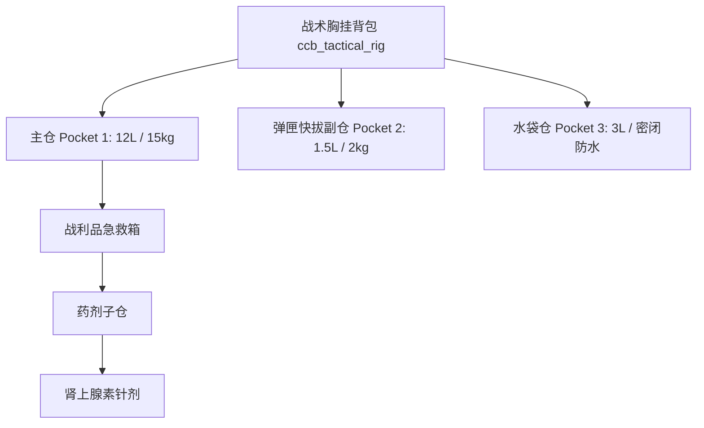

---
# GENERATED FROM docs-catalog.yml. DO NOT EDIT THIS BLOCK.
id: subsystems.items
title: 物品与 Pocket 容器系统技术手册
language: zh_CN
status: stale
doc_type: explanation
audiences:
- mod-author
- api-user
- experienced-contributor
- maintainer
owners:
- CCB Lua API maintainers
reviewers:
- Documentation reviewers
- Lua API reviewers
review_interval_days: 60
last_human_reviewer: LYHGLYTX
source_paths:
- data/lua/README.md
- data/lua/manifest.schema.json
- data/lua/types/ccb_api_v5.d.lua
- data/lua/reference/ccb_public_api_v5.json
- data/lua/reference/ccb_public_api_v5_coverage.json
- tools/lua_api/README.md
source_symbols:
- Lua Mod API v5
source_queries: []
source_fingerprint: 30a19e6cbd8c6709ac5ccda80fe349e9459ddaccd8d3dc96507ee282c17f48cb
authority: api-contract
verified_commit: d32b9cc880a85480840d82cfa05d256c78a16615
verified_at: '2026-08-02'
generated: false
generated_by: null
include_in_search: false
include_in_ai_index: false
translation_status: current
translation_stale_since: null
translation_source_fingerprint: 14952f644ee8353cbc308187e686095838c26808665aa67f9433a22456e9ca57
prerequisites:
- architecture.overview
depends_on: []
redirect_from: []
supersedes:
- lua.v5.overview
license: CC-BY-SA-3.0
attribution: CCB contributors; generated contract and source paths at the verified commit.
example_validation_ids: []
api_version: '5'
deprecated: false
deprecation_replacement: null
risk_group: lua-api
risk_level: high
pending_source_pr: null
stale_reason: Contains retired Lua API examples; Lua sections need Platform v1 source verification.
canonical_url: https://crimsoncrossbunker.github.io/CCB-Docs/subsystems/items/
alternate_urls:
  zh: https://crimsoncrossbunker.github.io/CCB-Docs/subsystems/items/
  en: https://crimsoncrossbunker.github.io/CCB-Docs/en/subsystems/items/
  x-default: https://crimsoncrossbunker.github.io/CCB-Docs/subsystems/items/
source_repository: https://github.com/CrimsonCrossBunker/Cataclysm-Cleanwater-Bomb
source_commit_url: https://github.com/CrimsonCrossBunker/Cataclysm-Cleanwater-Bomb/commit/d32b9cc880a85480840d82cfa05d256c78a16615
source_urls:
- path: data/lua/README.md
  url: https://github.com/CrimsonCrossBunker/Cataclysm-Cleanwater-Bomb/blob/d32b9cc880a85480840d82cfa05d256c78a16615/data/lua/README.md
- path: data/lua/manifest.schema.json
  url: https://github.com/CrimsonCrossBunker/Cataclysm-Cleanwater-Bomb/blob/d32b9cc880a85480840d82cfa05d256c78a16615/data/lua/manifest.schema.json
- path: data/lua/types/ccb_api_v5.d.lua
  url: https://github.com/CrimsonCrossBunker/Cataclysm-Cleanwater-Bomb/blob/d32b9cc880a85480840d82cfa05d256c78a16615/data/lua/types/ccb_api_v5.d.lua
- path: data/lua/reference/ccb_public_api_v5.json
  url: https://github.com/CrimsonCrossBunker/Cataclysm-Cleanwater-Bomb/blob/d32b9cc880a85480840d82cfa05d256c78a16615/data/lua/reference/ccb_public_api_v5.json
- path: data/lua/reference/ccb_public_api_v5_coverage.json
  url: https://github.com/CrimsonCrossBunker/Cataclysm-Cleanwater-Bomb/blob/d32b9cc880a85480840d82cfa05d256c78a16615/data/lua/reference/ccb_public_api_v5_coverage.json
- path: tools/lua_api/README.md
  url: https://github.com/CrimsonCrossBunker/Cataclysm-Cleanwater-Bomb/blob/d32b9cc880a85480840d82cfa05d256c78a16615/tools/lua_api/README.md
documentation_issue_url: https://github.com/CrimsonCrossBunker/CCB-Docs/issues/new?title=docs%28subsystems.items%29%3A+&body=Document+ID%3A+subsystems.items%0ALanguage%3A+zh_CN%0AVerified+commit%3A+d32b9cc880a85480840d82cfa05d256c78a16615%0A%0ADescribe+the+documentation+problem%3A%0A
search:
  exclude: true
---

> **Lua 内容待修订：** 本页仍含已移除的 v5 接口或旧运行时示例，不可作为当前 Lua 开发依据。请使用 [Platform v1 入门](../api/lua/v1/overview.md)。

# 物品与 Pocket 容器系统技术手册 (Items & Pockets Manual)

本手册详细剖析 **Cataclysm: Cleanwater Bomb (CCB)** 中的物品实体模型、物理量换算以及 CCB 独创的 **多 Pocket 容器树状嵌套机制**。

---

## 1. 物品物理量与度量衡标准

在 CCB 引擎中，所有物品的物理属性采用统一的公制度量衡：

* **重量 (Weight)**：底层整数存储，**单位为克 (g)**。例如 `1500` 代表 1.5 公斤。
* **体积 (Volume)**：底层整数存储，**单位为毫升 (ml)**。例如 `2500` 代表 2.5 升。
* **尺寸限制 (Length)**：**单位为毫米 (mm)**。用于长杆武器、长枪与刀鞘长度适配。
* **价格 (Price)**：**单位为美分 (cents)**。例如 `1000` 代表 10 美元。

---

## 2. Pocket 容器嵌套架构模型

CCB 彻底淘汰了老旧的单层背包扁平列表，所有容器（背包、弹匣、水壶、枪套、战术腰带）均由一个或多个 `pocket` 构成：



### Pocket 核心控制属性
* `max_contains_volume` (*integer*): 该口袋最大容纳体积 (ml)。
* `max_contains_weight` (*integer*): 该口袋最大承重上限 (g)。
* `max_item_length` (*integer*): 放入该口袋的物品最长几何尺寸 (mm)。
* `watertight` (*boolean*): 是否气密防水。为 `true` 时才可盛装水、汽油、酸液等未封口流体。
* `rigid` (*boolean*): 是否为刚性结构。若为 `false`，装入物品后容器外部体积会相应膨胀。
* `moves` (*integer*): 从该口袋拔取/放入物品所消耗的基础动作点数（AP）。

---

## 3. 核心 API 参考

### `game.items.register(config)`

向游戏引擎注册全新的物品原型。

**参数 (Parameters):**
* `config` (*table*, 必填): 物品原型定义表。包含 `id`, `name`, `weight`, `volume`, `pockets`, `melee`, `armor`, `on_use` 等配置项。

**实战示例 (Example):**
```lua
game.items.register({
    id = "ccb_canteen_sealed",
    name = "军用野战密封水壶",
    weight = 250,  -- 250 克自重
    volume = 1200, -- 1.2 升外部体积
    category = "container",
    pockets = {
        {
            pocket_type = "CONTAINER",
            max_contains_volume = 1000, -- 容纳 1 升液体
            max_contains_weight = 1200,
            watertight = true,          -- 密封防水
            open_container = false
        }
    }
})
```

---

### `item:get_total_weight() -> integer`

递归计算物品本体及其内部所有子 Pocket 中物品的总重量。

**返回值 (Returns):**
* *integer*: 真实总重量（克）。

---

### `item:has_flag(flag_name) -> boolean`

检查物品是否包含指定的特性标签（如 `"FIRE"`, `"LEAK_RESIST"`, `"SHEATH_KNIFE"`）。
